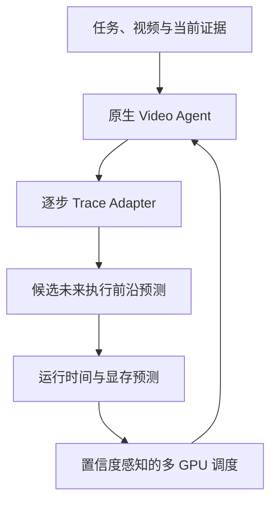

# 动态 Video Agent 预测式多 GPU 调度：Codex 工作指导书

> **用途**：作为后续 Codex 的工作说明。  
> **当前日期**：2026-07-30  
> **当前策略**：先用真实 Agent 轨迹验证研究假设；验证通过后才扩大到未来图预测、模拟调度和真实多 GPU 部署。

---

## 0. 给 Codex 的执行原则

1. 先读本文件、仓库 README、环境文件、当前实验记录和未提交改动，再提出或实施修改。
2. 不猜第三方仓库接口、数据格式、模型权重或 API；必须以当前固定 commit 的真实代码为准。
3. 不同时重写 Agent、预测器和调度器。每次只推进当前阶段的一项可验收工作。
4. 优先写外层 Adapter / wrapper，不侵入修改第三方 Agent 的业务逻辑；若必须改源码，要记录补丁和理由。
5. 每项结论都应落到可复查的配置、脚本、日志、原始 trace 或图表上。没有证据时必须明确写“未验证”。
6. 不为了让论文看起来更复杂而人为加入随机工具调用、伪造分支或把固定模板包装成动态图。
7. 不自动下载大规模数据集、不切换昂贵模型、不改变任务定义；先说明需要什么、为什么需要、最小下载量是多少。
8. 若发现当前工作负载没有动态性或调度机会，应给出 Go / No-Go 证据并建议换基座，而不是硬做模型。
9. API Key 只通过临时进程环境传递，不写入 YAML、日志、Git 或 shell 命令行；按用户明确指示继续使用现有 Key，不自动轮换。

---

## 1. 项目一句话定义

研究**在线 Video Agent 的未来执行路径未知、节点资源代价异构**时，如何根据任务、视频证据和已执行前缀预测后续候选计算节点及其资源需求，并据此进行模型放置、预加载、显存预留和多 GPU 在线调度，以降低端到端时延、尾延迟、截止期违约和模型加载开销。

本项目的重点不是“让 Agent 选到更好的工具”，而是：

> **预测尚未到达的计算需求，并把有置信度的预测安全地转化为 GPU 调度收益。**

---

## 2. 核心问题与研究边界

### 2.1 为什么传统调度不够

普通 DAG 调度默认任务图在执行前完整已知。Video Agent 却会根据问题、视频内容、当前证据和工具输出动态决定：

- 下一步调用什么视觉算子或模型；
- 查看哪段视频、抽取多少帧、用什么分辨率；
- 是否补充证据、重试或提前结束；
- 在领域工作流中，是否进入工具结果验证失败后的重试/修复循环（电梯流程中对应 tool_result_validator → 重试路径）。

因此调度器在任意时刻只能看到**执行前缀**，却要为可能在未来到达的大模型、显存和数据依赖提前作决定。

### 2.2 本项目真正要解决的映射



其中，未来预测器输出的不是单一硬标签，而是可被调度器消费的候选前沿，例如：

```json
{
  "task_id": "t_001",
  "observed_prefix": ["overview", "skim"],
  "candidate_nodes": [
    {
      "local_action": "focus",
      "probability": 0.62,
      "input_ref": {
        "video_id": "v_014",
        "interval_sec": [120, 145],
        "frames": 32
      },
      "branch": "normal_evidence_search"
    },
    {
      "local_action": "answer",
      "probability": 0.28,
      "input_ref": {
        "evidence_ids": ["e_03", "e_05"]
      },
      "branch": "early_stop"
    }
  ],
  "termination_probability": 0.10
}
```

再由资源预测器补充每个候选在不同 GPU、冷/热模型状态下的运行时间、峰值显存与加载成本。GPU 当前状态只进入调度器，**不应污染“Agent 本来会做什么”的语义预测器**。

### 2.3 当前明确不做

- 不把多个公开 Agent 硬拼成一个超级 Agent；
- 不要求不同 Agent 共享同一动作空间或同一预测器；
- 不把纯 runtime prediction、普通模型路由或 KV-cache 管理当作论文主体；
- 不默认上 GNN、强化学习或大模型微调；
- 不在第一阶段部署所有候选仓库；
- 不把 LLM/API 网络等待时间当作本地 GPU 计算时间；
- 不在真实轨迹分析之前宣称“动态执行图”已经成立。

---

## 3. 必须先验证的研究假设

| 编号 | 假设 | 需要的证据 | 若不成立怎么办 |
|---|---|---|---|
| H1 | 路径具有真实、内容相关的动态性 | 不同视频/问题的路径、长度、分支、终止点有稳定差异；重复同一输入可区分内容差异与 LLM 随机性 | VideoSeek 降级为补充基座，转向更动态的 Agent 或收缩问题 |
| H2 | 内容和执行前缀能预测未来 | 任务/视频证据 + 前缀明显优于静态先验和 Markov 的 next-node、剩余长度或未来集合预测 | 不做复杂预测器；检查是否只有固定模板 |
| H3 | 资源需求足够异构 | 不同节点、模型、帧数、冷/热状态的 runtime、VRAM、加载开销存在显著差异 | 引入 STAR / VideoTool 等多工具工作负载 |
| H4 | 知道未来会改变调度决策 | Oracle 比 Myopic scheduler 有实质收益；预测式调度可回收其中一部分收益 | 工作负载不适合主论文，避免上真实多 GPU |
| H5 | 预测错误可控 | 置信度校准、预算和回退后，错预加载/错预留不会拉低总体表现 | 提高保守性或只做预测辅助，不做投机执行 |

**项目成败顺序**：先 H1/H3，再 H2，最后 H4/H5。没有 H4，预测再准也不构成调度论文。

---

## 4. 工作负载与角色分工

| 优先级 | 工作负载 | 用途 | 何时使用 |
|---:|---|---|---|
| 1 | **VideoSeek** | 第一批真实 Agent trace；验证原生轨迹、路径动态性和 Trace Adapter | 现在立刻做 |
| 2 | **STAR / VideoTool** | 多视觉工具与异构模型，验证真实多 GPU 放置、模型驻留和显存调度 | 仅在 H1–H4 初步通过后 |
| 3 | **VideoMind** | 单模型多角色 Agent 的补充控制实验 | 主线稳定后再加 |
| 4 | **电梯检验材料包审核工作流** | evidence-工具循环、修复/回退、工具失败与领域迁移 | 公共基座和调度器稳定后接入 |

注意：此前讨论过的 YueFan1014/VideoAgent 与 jylins/videoseek 需要先由 Codex 核查**官方关系、当前可运行 commit、数据入口和原生 trajectory 格式**。未核验前不要把两个仓库当作同一实现，也不要依据记忆改代码。

### 电梯领域工作流（后续）

每组材料包为三段视频与 4–8 条结构化检验声明。**以电梯 Agent 流程图为权威**（见 `docs/elevator_agent_workflow_20260805.md`），节点级结构为：

```text
__start__ → normalize_input → probe_video → build_role_segments
    → initialize_requirement_queue → evidence_planner
    → tool_router →(execute_tool) tool_execution → tool_result_validator
    → update_evidence_graph → requirement_router
        ├─ continue ↺ → evidence_planner（主循环）
        ├─ done → aggregate_decisions
        └─（tool_router 侧）finish_requirement / done
    → aggregate_decisions → generate_report → __end__
```

语义说明：

- Detect / Track / OCR / Pose / 语义工具是 **tool_execution_node 内部的工具**（图中未展开），工具的资源曲线（显存/耗时）需电梯场景实测校准；
- Critic（支持/矛盾/证据不足/工具失败）等决策语义落在 **evidence_planner / requirement_router / tool_result_validator 的分支语义**中，不新增独立节点；具体映射在接入时确定；
- 工具失败、重试、修复（repair）对应 **tool_result_validator 验证失败 → 重试/修复路径**，是领域迁移验证的核心；
- 剩余时长 ≈ 当前节点成本 + 剩余循环数 × 单循环成本（evidence_planner + 工具执行 + 证据图更新），循环退出路径有三条，循环数分布重尾，调度用分位。

它是后续“条件分支、工具失败、回退、重试、模型切换”的真实案例；不是当前第一阶段的实现任务。

---

## 5. 相关工作应该怎样借，而不应怎样套

| 类别 | 可借的机制 | 不应直接照搬的部分 |
|---|---|---|
| DyOrc（SoCC 2025） | 未来路径信息进入模型放置、预加载、重调度的系统闭环 | 仅由服务调用频率/前缀做 Markov 预测；不看视频、任务语义和中间证据 |
| SpecFaaS（HPCA 2023） | 投机执行结果隔离、确认后提交、失败丢弃 | 它的函数图通常已知，只是预测分支 |
| Pythia / PASTE（arXiv 2026） | Top-K 概率未来、参数/输入引用分离、置信度驱动的投机 | 主要面向 LLM serving/cache；输入多是历史工具类型，不足以表示 Video Agent 内容条件 |
| 过程预测（如 SuTraN、Park & Song） | 前缀到后缀、时间和在线资源分配的评估方法 | 结构化业务日志与视频 Agent 的多模态证据不等价 |
| AutoTool（AAAI 2026） | 可作很弱的“下一动作序列”参考 | 目标是减少 LLM 调用并提升工具选择，不是预测未知计算需求做 GPU 调度；不作为核心基线 |

本项目的定位应保持为：

> **内容条件的概率未来执行前沿 + 资源需求预测 + 置信度感知在线多 GPU 调度。**

---

## 6. Trace Adapter：第一份真实数据的标准

### 6.1 设计原则

- 保留原始动作名与原始 Agent 输出；跨框架统一的是资源描述，不是业务动作。
- 原始 trace 永不覆盖；清洗/特征化结果另存。
- 记录依赖关系，不只记录线性 action 列表。
- 用单调时钟计时；本地 CUDA 工具前后同步，避免异步执行造成虚假低耗时。
- 显存记录至少包含 PyTorch allocated、reserved、进程峰值；可辅以 NVML。
- 明确模型是否已经驻留，区分冷启动、热启动、模型加载、数据解码、GPU 推理和外部 API 等待。
- 失败、重试、取消、早停、解析错误也都要成为事件。
- 每次运行绑定代码 commit、配置、模型版本、随机种子、GPU/CUDA/驱动和数据子集。

### 6.2 最小事件 schema（v0.1）

每个事件存入 JSONL；同时保存一个任务级 `run_manifest.json`。

```json
{
  "schema_version": "0.1",
  "run_id": "run_YYYYMMDD_001",
  "framework": "videoseek",
  "dataset": "native_subset",
  "task_id": "task_001",
  "step_id": 3,
  "parent_step_ids": [2],
  "action": "focus",
  "node_type": "video_observation",
  "model_id": "verified-model-name",
  "model_resident_before": true,
  "input": {
    "video_id": "video_001",
    "interval_sec": [120.0, 145.0],
    "frames": 32,
    "resolution": [720, 1280],
    "prompt_or_state_ref": "state_003"
  },
  "resource": {
    "gpu_id": 0,
    "gpu_model": "RTX 4090",
    "queue_ms": 0.0,
    "decode_ms": null,
    "load_ms": 0.0,
    "runtime_ms": 770.0,
    "peak_allocated_mb": 6240,
    "peak_reserved_mb": 7100
  },
  "status": "success",
  "retry_of": null,
  "output_summary_ref": "outputs/step_003.json",
  "timestamp_start": "ISO-8601",
  "timestamp_end": "ISO-8601"
}
```

### 6.3 任务级 manifest 至少应记录

- 视频长度、编码、分辨率及子集来源；
- 问题文本/任务类型（敏感内容用引用或脱敏摘要）；
- Agent 配置、最大步数、模型和精度；
- 总完成时间、答案/任务得分、轨迹长度、失败和重试次数；
- GPU 型号、驱动、CUDA、依赖环境、代码 commit；
- 运行是否包含外部 API；若有，分离 API 等待与 GPU 计算。

---

## 7. 阶段路线图与硬门槛

### Phase 0 — 仓库与环境核验（当前最高优先级）

**目标**：在一张 AutoDL RTX 4090（3090 亦可先尝试）上跑通一条原生任务，什么都不要“优化”。

**Codex 要做**：

1. 核实 VideoSeek 官方仓库、固定 commit、许可证、README、环境文件、模型权重和最小原生数据入口。
2. 识别是否需要 API、是否能离线运行、GPU 视觉模块在哪些路径实际执行。
3. 在不改变 Agent 决策逻辑的前提下跑通 1 条最小任务。
4. 保存原生 trajectory、完整 stdout/stderr、最终答案、环境信息、`nvidia-smi` 快照和粗粒度显存/耗时。
5. 写出 `docs/phase0_repo_audit.md`：真实入口、依赖、运行命令、已知阻塞、下一步 trace hook 位置。

**验收标准**：

- 一条任务端到端完成或失败原因被精确定位；
- 原始轨迹和答案可找到；
- GPU 是否实际参与、哪些组件耗时最长已知；
- 无静默改动 Agent 策略、无伪造 trace。

**停止规则**：如果环境、许可、API 或模型大小使它在单卡上不可复现，先报告可行替代方案与成本；不要绕过许可或偷偷换 Agent。

### Phase 1 — Trace Adapter v0.1

**目标**：不破坏原生运行，补齐逐节点输入、时间、显存、模型驻留和依赖记录。

**产出**：

- `tracing/schema/trace_v0_1.json`；
- `tracing/collectors/` 的外层 wrapper/hook；
- `tracing/validators/validate_trace.py`；
- 3 条完整 trace 和字段完整性报告；
- 单元测试：无 GPU、GPU 工具节点、失败/重试事件至少各一例。

### Phase 2 — 小样本动态性与资源画像

**目标**：运行 20–50 条预实验，确认采集可靠；再根据成本扩展到 100–300 条正式初始 trace。

**必须统计**：

- 路径长度分布、唯一路径数和主路径占比；
- 节点/工具频率、转移矩阵、下一动作熵；
- 同问题不同视频、同视频不同问题、同一输入重复运行的路径差异；
- 各节点的 runtime、显存、冷/热启动 P10/P50/P90；
- runtime 与帧数、分辨率、区间长度、模型驻留的关系；
- 失败/重试/早停比例。

**Go / No-Go 判断**：

- 若路径几乎固定或资源几乎同质：VideoSeek 只保留为 trace 采集补充，转向 STAR / VideoTool 或缩小论文叙事。
- 若路径存在真实内容相关差异、资源异构明显：进入预测与调度模拟。
- 不以“轨迹看上去长”代替动态性证据。

### Phase 3 — 简单预测基线，先不要 GNN/RL

**预测目标（按顺序）**：

1. 下一节点；
2. 剩余节点数 / 剩余时间；
3. 未来 K 步节点集合；
4. Top-K 候选分支或剩余图（仅当 trace 真的有分支时）。

**输入对照**：

| 组别 | 输入 |
|---|---|
| Static prior | 全局或任务类型先验 |
| Markov | 最近 1–2 个原始动作 |
| Prefix + task | 动作前缀、问题/声明特征 |
| Prefix + task + evidence | 再加入已产生工具输出摘要、低成本视频/证据 embedding |

**推荐基线**：多数类、按任务类型先验、一/二阶 Markov、Logistic Regression、XGBoost、LSTM 或小 Transformer。只有数据证明执行图有显式分支和合并关系时，才考虑图模型。

**验收**：必须报告相对 Markov/静态先验的增益、按路径位置的误差、概率校准和失败案例，而不是只给 Top-1 accuracy。

### Phase 4 — 真实 trace 回放的离散事件模拟器

**目标**：在租多卡前回答“前瞻到底值不值得”。

模拟器应包含：

- 在线任务到达、多 GPU、显存容量、异构 GPU；
- 节点依赖、测得的运行时间、模型加载/卸载、驻留状态；
- 当前节点调度、未来节点预测、错误预测、预算和回退；
- 可重复的随机到达率与 workload mix。

**首批基线**：

- Round Robin；
- Least Loaded；
- 当前节点感知的 Myopic；
- 静态平均模板；
- Oracle（知道真实完整后续轨迹）；
- 本项目的预测式调度。

**必须先看 Oracle gap**：

```text
若 Oracle ≈ Myopic：未来信息本身无价值，停止扩展。
若 Oracle > Myopic，但预测式无收益：先改预测/置信度/调度耦合。
若 Myopic < 预测式 < Oracle：方向成立，进入真实多 GPU。
```

**核心指标**：平均和 P95/P99 完成时间、吞吐、GPU 利用率、显存利用率、模型加载开销、deadline miss、错预加载浪费、相对 Oracle 差距。

### Phase 5 — STAR / VideoTool 与真实多 GPU

仅当 Phase 4 给出稳定正收益后做。此时验证：

- 真实异构视觉工具的模型放置与复用；
- 预加载、显存预留和 GPU 路由；
- 2 GPU 起步，理想为 4 GPU；先同构再异构；
- 模拟器预测与真实测量的校准误差；
- 任务到达率、显存压力、GPU 数量和预测错误敏感性。

### Phase 6 — 电梯审核工作流迁移

在公开基座稳定后接入电梯材料包审核工作流（流程以 `docs/elevator_agent_workflow_20260805.md` 的 14 节点图为权威）。核心价值是验证 evidence-工具循环下的工具失败、重试、回退分支和领域迁移；不应反过来阻塞 Phase 0–4。

---

## 8. 初版预测式调度器应长什么样

第一版不用强化学习。使用可解释、可消融的概率代价函数：

```text
score(node, gpu)
  = queue_time
  + predicted_runtime
  + model_load_cost
  + deadline_risk
  + future_memory_conflict_risk
  - model_or_artifact_reuse_gain
```

未来预测只在置信度和预算允许时影响决策：

- 预加载高概率模型；
- 为高概率大显存节点留有限空间；
- 将当前节点路由到更利于后续复用的 GPU；
- 低置信度时退化为 Myopic；
- 投机结果进入 shadow cache，Agent 真的请求同一节点才复用；
- 不允许低概率模型长期占用显存或饿死已就绪任务。

调度器与预测器的职责必须分开：

| 模块 | 主要输入 | 主要输出 |
|---|---|---|
| Future Predictor | 任务、视频/证据、执行前缀、工具输出摘要 | 候选未来节点、输入引用、分支概率、终止概率 |
| Resource Predictor | 候选节点、输入规模、模型、GPU 类型、冷/热状态 | runtime/VRAM 的点估计与分位数 |
| Scheduler | 两类预测 + GPU 队列、显存、模型驻留、优先级/截止时间 | 放置、排序、预加载、预留、回退 |

---

## 9. 推荐目录与结果管理

```text
project-root/
├── CODEX_WORK_GUIDE.md
├── PROJECT.md
├── docs/
│   ├── phase0_repo_audit.md
│   ├── decisions.md
│   ├── trace_schema.md
│   └── experiment_plan.md
├── third_party/
│   ├── videoseek/
│   └── star/
├── adapters/
├── tracing/
│   ├── schema/
│   ├── collectors/
│   └── validators/
├── analysis/
│   ├── trace_statistics/
│   └── notebooks/
├── predictors/
│   ├── future/
│   └── resource/
├── simulator/
├── scheduler/
│   ├── baselines/
│   └── predictive/
├── configs/
├── scripts/
├── tests/
└── results/
    ├── raw/
    ├── processed/
    ├── figures/
    └── tables/
```

第三方仓库应固定 commit，并尽量作为独立目录或 submodule 管理。数据、模型权重、原始视频和大缓存不提交 Git；提交下载说明、校验信息、配置和可复现实验脚本。

---

## 10. 当前唯一的可执行任务单

> **状态更新（2026-07-31）**：Phase 0 与 Phase 1 已完成并有独立验收文档；当前执行边界已进入 Phase 2。下方原始 Phase 0 启动指令保留作历史审计，不再覆盖当前 Phase 2 任务。当前 Phase 2 的边界、公开数据策略、批量入口和验收门槛以 `docs/phase2_dynamic_trace_collection.md` 为准。

历史启动单曾要求 Codex **只完成 Phase 0**，不要提前做预测模型、模拟器、STAR 或电梯工作流；该要求已随状态更新结束。

### 交给 Codex 的启动指令

```text
你正在执行“动态 Video Agent 预测式多 GPU 调度”项目的 Phase 0。

先完整阅读 CODEX_WORK_GUIDE.md 与 PROJECT.md。目标不是设计调度算法，
而是在单张 GPU 上以最小侵入方式跑通一个官方 VideoSeek 原生任务，
确认真实 Agent trajectory、GPU 参与方式、模型/API依赖与 trace hook 位置。

请严格按以下顺序工作：
1. 检查当前工作区状态、README、环境文件、固定 commit 和现有运行记录。
2. 核实候选 VideoSeek 仓库的官方性、安装方式、最小数据入口、许可证、
   模型权重与 API 依赖；不凭记忆猜接口。
3. 先输出一个简短的 Phase 0 执行计划和风险清单；仅在现有授权范围内进行安装、
   下载和运行。
4. 跑通 1 条最小原生任务，不修改 Agent 决策逻辑。
5. 保存原始 trajectory、完整日志、最终答案、环境/GPU信息与粗粒度耗时显存。
6. 产出 docs/phase0_repo_audit.md，准确说明：
   - 使用的仓库 URL 与 commit；
   - 已验证的命令与数据入口；
   - 原生 trajectory 的字段和文件位置；
   - 实际 GPU/CPU/API 路径；
   - 推荐的最小 Trace Adapter hook 点；
   - 失败、限制和下一步。

完成后停止，报告证据和下一步建议。不要：
- 部署 STAR、VideoMind 或电梯工作流；
- 训练 GNN、Transformer 或 RL；
- 下载完整大型数据集；
- 把 API 等待时间当 GPU 计算；
- 为制造动态性修改 Agent 行为；
- 无证据声称路径动态或调度有收益。
```

---

## 11. Phase 0 完成时必须交付的文件

| 文件 | 内容 |
|---|---|
| `docs/phase0_repo_audit.md` | 仓库、commit、环境、数据入口、真实运行路径、风险和 hook 建议 |
| `results/raw/phase0/...` | 原始 stdout/stderr、原生 trajectory、最终输出、GPU 快照 |
| `configs/...` | 实际使用的最小配置，不能只记录口头参数 |
| `docs/decisions.md` | 明确 Go / No-Go 判断与原因 |

这四项中缺任何一项，都不算 Phase 0 完成。

---

## 12. 两周内的合理目标

| 时间 | 可验收结果 |
|---|---|
| 第 1–2 天 | Phase 0：一条 VideoSeek 原生任务 + 真实轨迹 + 仓库核验 |
| 第 3–4 天 | Trace Adapter v0.1、validator、3 条完整 trace |
| 第 5–7 天 | 20–50 条预实验、动态性/资源画像报告、是否扩大采集的结论 |
| 第 8–10 天 | 100–300 条初始 trace（若通过门槛）+ 静态/Markov/XGBoost 预测基线 |
| 第 11–14 天 | Trace replay 模拟器、Myopic/Oracle/预测式调度对比、是否进入 STAR 的结论 |

时间表服从证据：前一阶段没有通过，不能靠加速开发跳到下一阶段。

---

## 13. 成功标准与论文落点

若实验逐级成立，论文可稳妥表述为：

1. 定义未来执行图部分未知的 Video Agent 在线 GPU 调度问题；
2. 以真实 Agent trace 量化路径动态性与资源异构性；
3. 预测内容条件下的未来候选节点、输入引用与资源需求；
4. 设计考虑预测置信度、模型驻留和错误代价的在线多 GPU 调度；
5. 用 Oracle、Myopic、静态模板和预测式方法说明未来信息何时有用、何时无用；
6. 在异构公共 Agent 和电梯审核工作流（evidence-工具循环 + 重试/修复分支）上验证泛化。

最重要的诚实边界：

> 不宣称“任意 Agent 都能被通用调度”；只证明在**真实动态、资源异构且 Oracle 有前瞻优势**的 Video Agent 工作负载上，预测式调度可带来可测量收益。
